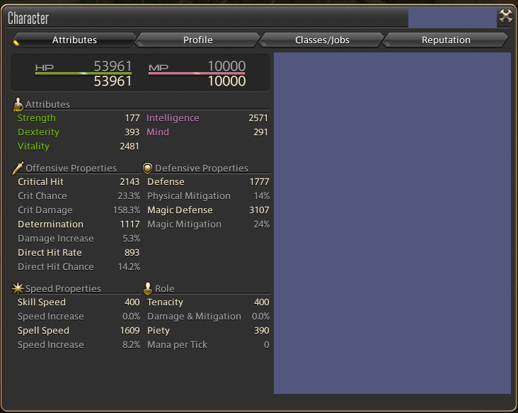

# Character Panel Refined

Character Panel Refined cuts away useless information from the character panel, while adding useful stats like critical hit and direct hit percentages as well as estimates damage output to allow for easier comparison of gear.

## Installation

Available for install via [Dalamud](https://github.com/goatcorp/FFXIVQuickLauncher)'s built-in plugin installer.

Alternatively check https://github.com/Kouzukii/DalamudPlugins on how to install my plugins directly.
